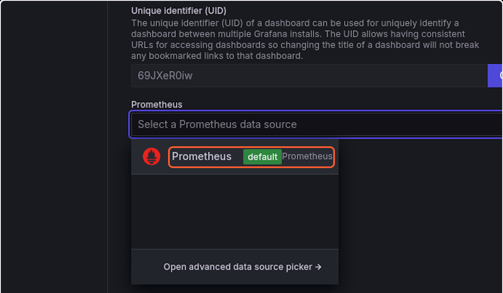

# Spring Petclinic Istion Pipeline

[](https://codespaces.new/tw0-face/petclinic?quickstart=1)

This project is about creating a pipeline for the [jave petclinic istio app](https://github.com/spring-petclinic/spring-petclinic-istio), using different DevOps and PlatformOps tools and techniques:

Cloud Provider: `GCP`

IAC GitOps: `terraform` + `terrateam`

Secret Store: `vault`

External Secret Management: `external secrets`

Source Code Scanning: `sonarqube`

SBOM Analysis: `dependency track` + `syft`

CI: `jenkins`

CD: `spinnaker`

Logging Stack: `ELK` + `FileBeat`

PlatformOps: `krateo`

CDE: `GitHub Codespaces`

Microservices testing: `signadot`

Service mesh: `istio`

Monitoring and Observability: `prometheus` + `grafana` + `kiali` + `jaeger`

> [!CAUTION]
> Due to some billing problems related to payment options in `gcloud`, I couldn't test the project on `gcloud` yet, regardless it was tested [locally](#local-setup) on a `rancher desktop` cluster and I decided to keep the `gcloud` instructions in case I revisited the project in the future or it helped somebody else since the official `spinnaker` docs are outdated so it was interesting for me to figure things out through the `spinnaker` source code


> The app consists of four microservices  `petclinic-customers-service`, `petclinic-frontend`, `petclinic-vets-service`, `petclinic-visits-service` and three `mysql` DBs


# Workflow Diagram


# Step By Step Guide

## Prerequisites

1. Install required cli tools: `kubectl`, `istioctl`, `helmfile`, `helm`, `kustomize`, `yq`

## Repo Setup

1. clone the repo: `git clone https://github.com/tw0-face/petclinic`

2. update the docker push registry to your own

```sh
cd petclinic
export PUSH_IMAGE_REGISTRY=<your registry>
CWD=$(pwd)
cd $CWD/petclinic-customers-service/manifests/base && kustomize edit set image petclinic-customers-service=${PUSH_IMAGE_REGISTRY}/petclinic-customers-service:1.0
cd $CWD/petclinic-frontend/manifests/base && kustomize edit set image petclinic-frontend=${PUSH_IMAGE_REGISTRY}/petclinic-frontend:1.0
cd $CWD/petclinic-vets-service/manifests/base && kustomize edit set image petclinic-vets-service=${PUSH_IMAGE_REGISTRY}/petclinic-vets-service:1.0
cd $CWD/petclinic-visits-service/manifests/base && kustomize edit set image petclinic-visits-service=${PUSH_IMAGE_REGISTRY}/petclinic-visits-service:1.0
cd $CWD
```

3. Build and push the images:
```sh
gcloud builds submit --tag gcr.io/$DEVSHELL_PROJECT_ID/mvnds:latest
gcloud container images add-iam-policy-binding gcr.io/[YOUR_PROJECT_ID]/[IMAGE_NAME] --member="allUsers" --role="roles/storage.objectViewer"
# docker build -t annamartin123/mvnds:latest . 
# docker push annamartin123/mvnds
```
> a simple way is to run this in gcloud shell, this docker image will be used as a jenkins agent container

4. edit `./manifests/jenkins-values.yaml` file and replace `https://github.com/tw0-face/petclinic` with your repo
5. edit `./manifests/jenkins-values.yaml` file and replace `gcr.io/petclinic-mostafa/mvnds:latest` with your image
6. change the `repoProjectKey` in `./manifests/spinnaker/petclinic-frontend-app.json`, `./manifests/spinnaker/petclinic-customers-service-app.json`, `./manifests/spinnaker/petclinic-vets-service-app.json`, `./manifests/spinnaker/petclinic-visits-service-app.json` with your github username
7. change the `ghUser` in `./manifests/spinnaker/petclinic-frontend-pipeline.json`, `./manifests/spinnaker/petclinic-customers-service-pipeline.json`, `./manifests/spinnaker/petclinic-vets-service-pipeline.json`, `./manifests/spinnaker/petclinic-visits-service-pipeline.json` with your github username
8. push to your own repo
9. create a token and save it as we gonna need it


## Environment Setup

### Create Clusters (WIP)

1. using `terraform` and `terrateam`

Edit `Infrastructure/locals.tf` with your project id

2. setup `gcloud`

```sh
BUCKET_NAME=
PROJECT_ID=$(gcloud config get-value project)
PROJECT_NUMBER=$(gcloud projects describe $PROJECT_ID --format="value(projectNumber)")
GITHUB_ORG=

# bucket for storage
gcloud storage buckets create gs://$BUCKET_NAME \
    --location="US" \
    --uniform-bucket-level-access

gcloud iam service-accounts create terrateam \
--description="Terrateam" \
--display-name="Terrateam" \
--project="$PROJECT_ID"

gcloud iam workload-identity-pools create "terrateam-pool" \
  --project="${PROJECT_ID}" \
  --location="global" \
  --display-name="Terrateam pool"

gcloud iam workload-identity-pools providers create-oidc "terrateam-provider" \
  --project="${PROJECT_ID}" \
  --location="global" \
  --workload-identity-pool="terrateam-pool" \
  --display-name="Terrateam provider" \
  --attribute-mapping="google.subject=assertion.sub,attribute.actor=assertion.actor,attribute.repository=assertion.repository,attribute.repository_owner=assertion.repository_owner" \
  --issuer-uri="https://token.actions.githubusercontent.com"

gcloud iam service-accounts add-iam-policy-binding "terrateam@${PROJECT_ID}.iam.gserviceaccount.com" \
  --project="${PROJECT_ID}" \
  --role="roles/iam.workloadIdentityUser" \
  --member="principalSet://iam.googleapis.com/projects/${PROJECT_NUMBER}/locations/global/workloadIdentityPools/terrateam-pool/attribute.repository_owner/${GITHUB_ORG}"

gcloud projects add-iam-policy-binding ${PROJECT_ID} \
--member="serviceAccount:terrateam@${PROJECT_ID}.iam.gserviceaccount.com" \
--role='roles/editor'
```

3. granting clusterrole permissions

```sh
gcloud container clusters get-credentials $CLUSTER_NAME \
    --zone $ZONE \
    --project $PROJECT_ID
# you need to grant the cluster admin role to install istio and elastic operator
kubectl create clusterrolebinding cluster-admin-binding --clusterrole=cluster-admin --user=$(gcloud config get-value core/account)
```

## Krateo PlatformOps (WIP)

> [!CAUTION]
> While trying `krateo` out I faced some issues with the project as it's in early stage and somethings are not documented so I had to figure them out on my own, this part is left as I might revisit it later

The end goal is to make it easier for developers to create on-demand databases for testing, the developers can either create a kubernetes pod database or a cloud managed one through `KCC`

```sh
helm repo add krateo https://charts.krateo.io
helm repo update krateo
helm upgrade installer installer \
  --repo https://charts.krateo.io \
  --namespace krateo-system \
  --create-namespace \
  --set krateoplatformops.service.type=LoadBalancer \
  --set krateoplatformops.service.externalIpAvailable=true \
  --install \
  --version 2.4.0 \
  --wait
kubectl wait krateoplatformops krateo --for condition=Ready=True --namespace krateo-system --timeout=300s
# krateo portal ip
kubectl get svc krateo-frontend -n krateo-system  -o=jsonpath='{.status.loadBalancer.ingress[0].ip}'
# krateo admin password
kubectl get secret admin-password  -n krateo-system -o jsonpath="{.data.password}" | base64 -d
```

- `Krateo` uses `helm` charts to create `composition definition` basically it's creating a `CRD` from the helm chart and the `values.schema.json` is used for the schema where a `composition` is an instance of the `composition definition` once created the controller installs the relevant helm chart on the cluster
- The `composition` can be created as yaml file and applied to the cluster, or can be created through `krateo` GUI, where a `form` is used to provide the `helm` values defined in the `values.schema.json`

- When dealing with `krateo` there are two important charts: 
`template` : is the one used to create the `composition definition`, `form` and the `widget` shown in the UI
`composition portal basic`: should be added as a dependency chart to the chart defined in the `composition definition`, so when a `composition` is created, the relevant `UI` elements are created

```sh
# install chart museum
helm repo add bitnami https://charts.bitnami.com/bitnami
helm repo add chartmuseum https://chartmuseum.github.io/charts
helm upgrade --install chartmuseum chartmuseum/chartmuseum \
  --namespace chartmuseum \
  --create-namespace \
  --version 3.10.3 \
  --set service.type=LoadBalancer --set env.open.DISABLE_API=false
# ctreate chart directory
mkdir -p postgresql/templates
# get postgresql chart
helm template postgresql --namespace krateo-system bitnami/postgresql > postgresql/templates/resources.yaml
```
- create the `Chart.yaml` with the `composition-portal-basic` defined as dependency
- add `values.yaml` and `values.schema.json`

```sh
# install helm push plugin
helm plugin install https://github.com/chartmuseum/helm-push
# add custom chartmuseum helm repo
helm repo add local-chartmuseum <chart repo link>
# push the chart
helm cm-push postgresql local-chartmuseum
```

- In `template-chart` edit the `manifests/krateo/template-chart/chart/values.yaml` with the `url` of chartmuseum

```sh
helm install postgresql -n krateo-system ./manifests/krateo/template-chart/chart
```


## Pipeline Tools Setup

### Sonarqube Setupe

1. Install `Sonarqube`

```sh
helm repo add sonarqube https://SonarSource.github.io/helm-chart-sonarqube
helm repo update
helm upgrade --install -n sonarqube --set community.enabled=true,monitoringPasscode="sonarqube12345" --create-namespace sonarqube sonarqube/sonarqube --set postgresql.persistence.size=10Gi --set service.type=LoadBalancer
```
> after sonarqube is installed use `kubectl get service sonarqube -n sonarqube -o jsonpath='{.status.loadBalancer.ingress[0].ip}'` to get the external ip of service and access it on port `9000`, use `admin:admin` to login and change the default password

2. Create `Sonarqube` Projects for our Apps


> Follow the instructions to create Sonarqube project, repeat for every microservice.

3. Create Sonarqube Token


> note it down cause we are gonna use it later

### Dependency track Setup

> [!CAUTION]
> `Dependency track` consists of two parts: a frontend and an API service, Although helm installs both services they are decoubled and not connected together by default, for the frontend to access the backend you need to set the `API_BASE_URL`, where that url should be accesseble from the browser where you are viewing the frontend app, not from the frontend service, the frontend app doesn't communicate with API server directly it just service static files, so you cannot use `http://dependency-track-api-server.dependency-track.svc.cluster.local:8080`. If using `port-forward` to access the set `API_BASE_URL=http://localhost:8080`, if using a load balancer to expose the app make sure to use the ip of that external load balancer or else you will get `HTTP Request Error Not Allowed (405)`.
> Although not mention in [Kuberntes installation docs](https://docs.dependencytrack.org/getting-started/deploy-kubernetes/) you can find some comments about that in [docker docs](https://docs.dependencytrack.org/getting-started/deploy-docker/)

1. Install `Dependency track`

```sh
gcloud compute addresses create dtrack-api-ip --region=us-central1
export LB_IP=$(gcloud compute addresses describe dtrack-api-ip --region=us-central1 --format="get(address)")
```
> create a static ip for the loadbalancer to be used


```sh
helm repo add dependencytrack https://dependencytrack.github.io/helm-charts
helm repo update
helm upgrade --install dependency-track dependencytrack/dependency-track --version 0.28.0 -n dependency-track --create-namespace --set apiServer.service.type=LoadBalancer --set apiServer.service.annotations."cloud\.google\.com/l4-rbs"="enabled" --set apiServer.service.annotations."networking\.gke\.io/load-balancer-ip-addresses"=${LB_IP}  --set frontend.apiBaseUrl=${LB_IP}  --set apiServer.resources.requests.memory=2Gi --set apiServer.extraEnv\[0\].name=SYSTEM_REQUIREMENT_CHECK_ENABLED --set apiServer.extraEnvVars\[0\].value=false
```
> you can view the app at port `8080`, use `admin:admin` to login and change the default password

1. Create Dependency track token


> make sure to grant the required permissions for [jenkins plugin](https://plugins.jenkins.io/dependency-track/#plugin-content-permission-overview) note it down cause we are gonna use it later

## Secrets Setup

### Vault Setup

```sh
# Install vault
helm repo add hashicorp https://helm.releases.hashicorp.com
# note that for this project i used a non ha vault, consider using ha vault for prod
helm upgrade --install vault hashicorp/vault -n vault --create-namespace
# Initialize the operator and unseal the vault
kubectl exec -n vault -it vault-0 -- sh
# note that for this project i used only one key as it's only me consider using proper distribution of keys in prod
# consider following for prod https://developer.hashicorp.com/vault/tutorials/kubernetes/kubernetes-google-cloud-gke
vault operator init -key-shares=1 -key-threshold=1
vault operator unseal <VAULT_UNSEAL_KEY>
vault status
vault login <VAULT_TOKEN>
# enable key-value store
vault secrets enable -path=secret kv-v2
# save all the token that you saved earlier into vault
vault kv put secret/cicd-credentials/sonarqube sonarqube-api-token=<sonarqube token>
vault kv put secret/cicd-credentials/dependency-track dependency-track-api-token=<dependency track token>
vault kv put secret/cicd-credentials/git-token gh-user=<gh username> gh-token=<github token>
# copy the read policy to our pod from another tab
kubectl cp ./manifests/secrets/cicd-policy.json vault/vault-0:/home/vault/cicd-policy.json
vault policy write cicd-policy /home/vault/cicd-policy.json
# using the root token is not a best practice, check https://developer.hashicorp.com/vault/docs/concepts/tokens
# create a non root service token
vault token create -policy="cicd-policy" -display-name="cicd-service-token"
```

### External Secrets Setup


Change the token in `/manifests/secrets/external-secret-config.yaml` with your `vault` token

```sh
helm repo add external-secrets https://charts.external-secrets.io
helm upgrade --install external-secrets external-secrets/external-secrets -n external-secrets --create-namespace
# sync secrets from vault to spinnaker namespace
kubectl create namespace spinnaker
kubectl apply -f ./manifests/secrets/external-secret-config.yaml
# secrets are labeled to be auto imported to jenkins with the kubernetes credentials provider plugin
kubectl apply -f ./manifests/secrets/sonarqube-token.yaml
kubectl apply -f ./manifests/secrets/dtrack-token.yaml
kubectl apply -f ./manifests/secrets/gh-token.yaml
```

## Jenkins Setup

I am using `JCasC` to install `jenkins` with initial configurations and declarative jobs to build the microservices, using `dind` as a sidecar container for the docker socket and  a custom image that have `maven` for app build, `docker` client and some other tools.

1. I am using ingress to access `jenkins`, change `jenkinsUrl` in `manifests/jenkins/values.yaml` with the ingress ip

2. Change the `PUSH_IMAGE_REGISTRY` in the `groovy` pipeline files for your registry

```sh
# jenkins casc takes care of jenkins setup for us even the pipeline files are imported from our git repo
helm upgrade --install jenkins --values ./manifests/jenkins/values.yaml --namespace spinnaker --create-namespace jenkins/jenkins
```
> you can login to `jenkins` with `admin:admin` on `<ingress ip>/jenkins`

this takes care of installing `jenkins`, setup the jobs, and install some plugins like the `kubernetes-credentials-provider` plugin required to read kubernetes secrets


3. create github webhook to trigger `jenkins`


## Application Setup

### Install Istio

```sh
# For private GKE clusters
# An automatically created firewall rule does not open port 15017. This is needed by the istiod discovery validation webhook.
# To review this firewall rule for master access:
# gcloud compute firewall-rules list --filter="name~gke-${CLUSTER_NAME}-[0-9a-z]*-master"
# To replace the existing rule and allow master access:
# gcloud compute firewall-rules update <firewall-rule-name> --allow tcp:10250,tcp:443,tcp:1501

istioctl install -f ./manifests/istio/istio-install-manifest.yaml -y
```

### Setup Monitoring

1. 

```sh
kubectl apply -f https://raw.githubusercontent.com/istio/istio/release-1.24/samples/addons/prometheus.yaml
kubectl patch service -n istio-system prometheus -p '{"spec": {"type": "LoadBalancer"}}'
kubectl apply -f https://raw.githubusercontent.com/istio/istio/release-1.24/samples/addons/jaeger.yaml
kubectl patch service -n istio-system jaeger -p '{"spec": {"type": "LoadBalancer"}}'
kubectl apply -f https://raw.githubusercontent.com/istio/istio/release-1.24/samples/addons/grafana.yaml
kubectl patch service -n istio-system grafana -p '{"spec": {"type": "LoadBalancer"}}'
kubectl apply -f https://raw.githubusercontent.com/istio/istio/release-1.24/samples/addons/kiali.yaml
kubectl patch service -n istio-system kiali -p '{"spec": {"type": "LoadBalancer"}}'
kubectl apply -f manifests/istio/telemetry.yaml
```
> install monitoring stack and expose it

2. Add `grafana` dashboard to monitor our app




> follow the steps to add `grafana-petclinic-dashboard.json` dashboard to `grafana`


### Install Petclinic App

1. Run the 5 `jenkins` jobs manually once to populate the docker registry with the images and track github changes

```sh
# enable istio sidecar for the petclinic namespace
kubectl create ns petclinic -o yaml | kubectl label -f - istio-injection=enabled
# set up the istio gateway (i don't have a domain name so i set host to *)
kubectl apply -f manifests/istio/gateway.yaml
# use helmfile to install the 4 microservices and the 3 db instances
helmfile apply
# use istio authorization to restrict access to db instances to only their respective microservices
kubectl apply -f manifests/istio/authorization-policies.yaml
```
Running `helmfile apply` saved us from running

```sh
helm install -n petclinic customers-db-mysql oci://registry-1.docker.io/bitnamicharts/mysql --set auth.database=service_instance_db --set global.defaultStorageClass=openebs-hostpath --set primary.persistence.size=1Gi  --version 12.3.0

helm install -n petclinic visits-db-mysql oci://registry-1.docker.io/bitnamicharts/mysql --set auth.database=service_instance_db --set global.defaultStorageClass=openebs-hostpath --set primary.persistence.size=1Gi  --version 12.3.0

helm install -n petclinic vets-db-mysql oci://registry-1.docker.io/bitnamicharts/mysql --set auth.database=service_instance_db --set global.defaultStorageClass=openebs-hostpath --set primary.persistence.size=1Gi  --version 12.3.0

kubectl apply -k petclinic-frontend/manifests/overlays/prod

kubectl apply -k petclinic-customers-service/manifests/overlays/prod

kubectl apply -k petclinic-vets-service/manifests/overlays/prod

kubectl apply -k petclinic-visits-service/manifests/overlays/prod
```

### Setup logging

`ELK` logging stack is installed using the `ECK` operator, in this setup `filebeats` autodiscover and collects logs and sends them to elastic stack and creates an index that can be viewed on `kibana` automatically, `logstash` can be used as a middleware for log aggregation if needed moving forward

```sh
helm repo add elastic https://helm.elastic.co
helm repo update
# install eck operator
helm install elastic-operator elastic/eck-operator -n elastic-system --create-namespace --wait
k apply -f ./manifests/logging/elasticsearch.yaml --wait
k apply -f ./manifests/logging/kibana.yaml --wait
k apply -f ./manifests/logging/logstash.yaml --wait
k apply -f ./manifests/logging/filebeat.yaml --wait
```
> use `kibana-kb-http` service to access `kibana` dashboard (use `https` if tls is configured)
> `kubectl get secrets -n logging elasticsearch-es-elastic-user -o jsonpath='{.data.elastic}' | base64 -d` to get the password
> login with : `elastic:<password>`


## Spinnaker Setup

> [!IMPORTANT]  
> Although the project itself receives regular updates, some of the [docs](spinnaker.io/docs) are outdated, So I had to come up with workarounds


- To install `spinnaker` I will be using a custom Deployment with two containers one is `halyard` to install and configure `spinnaker` on my cluster and the other is `spin cli` which will be used to configure the apps and pipelines, also two loadbalancers are created to expose deck and gate note, their ips down

- In this setup we will have two cluster a management cluster that have all our pipeline tools alongside it will also be used as a prod-like cluster by `signadot`, and a production cluster.

- By default `GKE` kubeconfig uses `gcloud` cli for auth to our cluster, that's difficult to be used with `CICD` tools, for that we need to use serviceaccounts, we instruct `spinnaker` to use the serviceaccount in our management cluster to deploy our apps, and we generate a custom kubeconfig for our prod cluster to be used with spinnaker, the RBAC can be controlled to only allow `spinnaker` to deploy certain resources to certain namespaces which is a good practice for production environment, for now we will grant `spinnaker` `cluster-admin` role, we gonna use a helper script to create the required kubeconfig for our prod cluster

```sh
# setup kubectl current context for our prod cluster
gcloud container clusters get-credentials <prod cluster name> --zone <zone> --project <project id>
# install rbac in the prod cluster
kubectl apply -f manifests/spinnaker/spin-rbac.yaml
# use helper script to create kubeconfig file
chmod +x manifests/spinnaker/kube-config-creator.sh
./manifests/spinnaker/kube-config-creator.sh
```
> this creates our kubeconfig under `manifests/spinnaker/spinnaker-prod-kubeconfig.yaml`

- Spinnaker needs a cloud bucket for storage and needs access to our docker resgistry, `front50` is the service responsible for storing metadata and for that we will use `gcs` for backend storage, also `kayenta` stores canary data in our `gcs`. `clouddriver` is the service responsible for docker authentication. we need service accounts to authenticate to gcloud
- Although the documentaion instructions for both [storage](https://spinnaker.io/docs/setup/install/storage/gcs/) and [docker](https://spinnaker.io/docs/setup/install/providers/docker-registry/) are to create Service account keys for auth
going through the source code of the services I found out that

```java
  public Credentials gcsCredentials(GcsProperties gcsProperties) throws IOException {

    String jsonPath = gcsProperties.getJsonPath();

    GoogleCredentials credentials;
    if (!jsonPath.isEmpty()) {
      try (FileInputStream fis = new FileInputStream(jsonPath)) {
        credentials = GoogleCredentials.fromStream(fis);
      }
      log.info("Loaded GCS credentials from {}", value("jsonPath", jsonPath));
    } else {
      log.info(
          "spinnaker.gcs.enabled without spinnaker.gcs.jsonPath. "
              + "Using default application credentials. Using default credentials.");
      credentials = GoogleCredentials.getApplicationDefault();
    }

    return credentials.createScopedRequired()
        ? credentials.createScoped(Collections.singleton(StorageScopes.DEVSTORAGE_FULL_CONTROL))
        : credentials;
  }
```
> In [front50](https://github.com/spinnaker/front50/blob/ceda49e0cb67925d85f0dc7f928c8909f53f1813/front50-gcs/src/main/java/com/netflix/spinnaker/front50/config/GcsConfig.java#L107C1-L108C1) if jsonfile that contains the account keys was not passed it falls to calling `getApplicationDefault` and according to [gcp docs](https://cloud.google.com/java/docs/reference/google-auth-library/latest/com.google.auth.oauth2.GoogleCredentials#com_google_auth_oauth2_GoogleCredentials_getApplicationDefault__) this can be used to get credentials from google compute instances or also `GKE` pods if `workload identity` is enabled

```java
  protected GoogleCredentials getCredentials(Collection<String> scopes) throws IOException {
    log.debug(
        "Loading credentials for project {} using application default credentials, with scopes {}.",
        project,
        scopes);

    // No JSON key was specified in matching config on key server, so use application default
    // credentials.
    return GoogleCredentials.getApplicationDefault().createScoped(scopes);
  }
```
> [kayenta](https://github.com/spinnaker/kayenta/blob/a69573be9d8fededacf80817e4151a2c8df41276/kayenta-google/src/main/java/com/netflix/kayenta/google/security/GoogleClientFactory.java#L76) also uses the same method

```java
  String getBasicAuth() {
    if (!(username || password || passwordCommand || passwordFile)) {
      return null
    }

    def resolvedPassword = null

    if (password) {
      resolvedPassword = password
    } else if (passwordCommand) {
      def pb = new ProcessBuilder("bash", "-c", passwordCommand)
      def process = pb.start()
      def errCode = process.waitFor()
      log.debug("Full command is: ${pb.command()}")
      if (errCode != 0) {
        def err = IOUtils.toString(process.getErrorStream(), StandardCharsets.UTF_8)
        log.error("Password command returned a non 0 return code, stderr/stdout was: '${err}'")
      }
      resolvedPassword = IOUtils.toString(process.getInputStream(), StandardCharsets.UTF_8).trim()
      log.debug("resolvedPassword is ${resolvedPassword}")
    } else if (passwordFile) {
      resolvedPassword = new BufferedReader(new FileReader(passwordFile)).getText()
    } else {
      resolvedPassword = "" // I'm assuming it's ok to have an empty password if the username is specified
    }
    if (resolvedPassword?.length() > 0) {
      def message = "Your registry password has %s whitespace, if this is unintentional authentication will fail."
      if (resolvedPassword.charAt(0).isWhitespace()) {
        authWarning = sprintf(message, ["leading"])
      }

      if (resolvedPassword.charAt(resolvedPassword.length() - 1).isWhitespace()) {
        authWarning = sprintf(message, ["trailing"])
      }
    }

    return new String(Base64.encoder.encode(("${username}:${resolvedPassword}").bytes))
  }
```
> On the other hand [clouddriver](https://github.com/spinnaker/clouddriver/blob/5e0ce2abb37cce236e4fb65b5f1ffa4ee781346e/clouddriver-docker/src/main/groovy/com/netflix/spinnaker/clouddriver/docker/registry/api/v2/auth/DockerBearerTokenService.groovy#L68) doesn't use google SDK for auth but uses a custom docker client library, as you can see if no password was passed it falls to creating a child process with `passwordCommand` that fetches the password for us, as you can see the [dockerfile](https://github.com/spinnaker/clouddriver/blob/5e0ce2abb37cce236e4fb65b5f1ffa4ee781346e/Dockerfile.ubuntu#L49) of `clouddriver` installs `gcloud cli`, so we will have it in our container, according to [gcp docs](https://cloud.google.com/artifact-registry/docs/docker/authentication#token) we can use `gcloud auth print-access-token` to get a token for login and that's the workaround that we gonna use you can see in the [halyard cli docs](https://spinnaker.io/docs/reference/halyard/commands/#hal-config-provider-docker-registry-account-add) that we can pass the command through `--password-command` flag

1. Set `gcloud` cli if not set

```sh
gcloud init
PROJECT_ID=
REGION=us-central1
ZONE=us-central1-a
gcloud config list
gcloud config set project $PROJECT_ID
gcloud config set compute/region $REGION
gcloud config set compute/zone $ZONE
```

2. Grant the required IAM roles for current user

```sh
PROJECT_ID=$(gcloud config get-value project)
PROJECT_NUMBER=$(gcloud projects describe $PROJECT_ID --format="value(projectNumber)")

# Get current user email
USER_EMAIL=$(gcloud config get-value account)

# Grant the roles to the current user
gcloud projects add-iam-policy-binding $PROJECT_ID \
  --member="user:${USER_EMAIL}" \
  --role="roles/container.admin"

gcloud projects add-iam-policy-binding $PROJECT_ID \
  --member="user:${USER_EMAIL}" \
  --role="roles/iam.serviceAccountAdmin"
```

3. Get cluster credentials

```sh
LOCATION=
gcloud container clusters get-credentials $CLUSTER_NAME \
    --location=$LOCATION
```

4. create service accounts

```sh
NAMESPACE=spinnaker
# spin-clouddriver-sa is already created
kubectl create sa spin-front50-sa -n ${NAMESPACE}
kubectl create sa spin-kayenta-sa -n ${NAMESPACE}
kubectl create sa mvn-builder-sa -n ${NAMESPACE}
```

5. grant gcloud role for the kubernetes service accounts

```sh
# https://cloud.google.com/kubernetes-engine/docs/how-to/workload-identity#using_from_your_code
# https://stackoverflow.com/questions/79055597/what-iam-role-is-required-for-using-the-docker-registry-catalog-v2-api-with-gcp
gcloud projects add-iam-policy-binding projects/${PROJECT_ID} \
    --role=roles/artifactregistry.reader \
    --member=principal://iam.googleapis.com/projects/${PROJECT_NUMBER}/locations/global/workloadIdentityPools/${PROJECT_ID}.svc.id.goog/subject/ns/${NAMESPACE}/sa/spin-clouddriver-sa \
    --condition=None
gcloud projects add-iam-policy-binding projects/${PROJECT_ID} \
    --role=roles/browser \
    --member=principal://iam.googleapis.com/projects/${PROJECT_NUMBER}/locations/global/workloadIdentityPools/${PROJECT_ID}.svc.id.goog/subject/ns/${NAMESPACE}/sa/spin-clouddriver-sa \
    --condition=None

gcloud projects add-iam-policy-binding projects/${PROJECT_ID} \
    --role=roles/storage.admin \
    --member=principal://iam.googleapis.com/projects/${PROJECT_NUMBER}/locations/global/workloadIdentityPools/${PROJECT_ID}.svc.id.goog/subject/ns/${NAMESPACE}/sa/spin-front50-sa \
    --condition=None

gcloud projects add-iam-policy-binding projects/${PROJECT_ID} \
    --role=roles/storage.admin \
    --member=principal://iam.googleapis.com/projects/${PROJECT_NUMBER}/locations/global/workloadIdentityPools/${PROJECT_ID}.svc.id.goog/subject/ns/${NAMESPACE}/sa/spin-kayenta-sa \
    --condition=None

gcloud projects add-iam-policy-binding projects/${PROJECT_ID} \
    --role=roles/artifactregistry.writer \
    --member=principal://iam.googleapis.com/projects/${PROJECT_NUMBER}/locations/global/workloadIdentityPools/${PROJECT_ID}.svc.id.goog/subject/ns/${NAMESPACE}/sa/mvn-builder-sa \
    --condition=None
```

6. create buckets

```sh
FRONT50_BUCKET_NAME="spin-front50-587456"
KAYENTA_BUCKET_NAME="spin-kayenta-587456"

# Create bucket in US multi-region with uniform access
gcloud storage buckets create gs://$FRONT50_BUCKET_NAME \
    --location="US" \
    --uniform-bucket-level-access
gcloud storage buckets create gs://$KAYENTA_BUCKET_NAME \
    --location="US" \
    --uniform-bucket-level-access
```

7. create `artifact registry`

```sh
gcloud artifacts repositories create petclinic-istio \
  --repository-format=docker \
  --location=us-central1 \
  --project=$PROJECT_ID
```

8. Install the spin-installer: `kubectl apply -k ./manifests/spinnaker`

9. use `kubectl exec -n spinnaker -it spin-installer -c halyard -- sh` to run the following commands inside `halyard` container:

```sh
# enable kubernets provider and user service account instead of kubeconfig to deploy spinnaker to cluster
hal config provider kubernetes enable
hal config provider kubernetes account add management-cluster --service-account=true --environment=dev
# use the `spin-clouddriver-sa` as service account for the clouddriver service so it can deploy apps to kubernetes
# cloud driver is the part of spinnaker which is responsible for communicating with the cloud provider so in case of kubernetes it's used to deploy a manifest or delete it for example
mkdir ~/.hal/default/service-settings
echo "kubernetes:
  serviceAccountName: spin-clouddriver-sa" > ~/.hal/default/service-settings/clouddriver.yml
# add an account for the prod cluster
hal config provider kubernetes account add prod-cluster --environment=prod --kubeconfig-file /home/spinnaker/kubeconfigs/spinnaker-prod-kubeconfig.yaml
# use distributed installation so each service is deployed seperately (recommended for prod)
hal config deploy edit --type distributed --account-name management-cluster
# configure authentication with jenkins
hal config ci jenkins enable
echo $JENKINS_PASS | hal config ci jenkins master add jenkins-master --address $JENKINS_EP --username $JENKINS_USR --password
# enable spinnaker artifacts
hal config features edit --artifacts-rewrite true
hal config features edit --artifacts true
# authenticate with github (useful for traffic limits and private repos)
hal config artifact github enable
echo $GH_TOKEN | hal config artifact github account add github-artifact-account --token
# the difference between gitrepo and github is that gitrepo is used to clone the whole repo and so it can access folders (mainly used with kustomize) while github is used to access files (mainly used with manifests)
hal config artifact gitrepo enable
echo $GH_TOKEN | hal config artifact gitrepo account add gitrepo-artifact-account --token
# the storage is used by spinnaker front-50 to save metadata
hal config storage gcs edit --bucket $FRONT50_BUCKET_NAME  --project $PROJECT_ID --bucket-location us
hal config storage edit --type gcs
# add docker registry
ADDRESS=us-central1-docker.pkg.dev
hal config provider docker-registry enable
# https://cloud.google.com/artifact-registry/docs/docker/authentication#token
hal config provider docker-registry account add my-docker-registry --address $ADDRESS --username oauth2accesstoken --password-command "gcloud auth print-access-token"
# enable canary config and use prometheus as a source
hal config canary enable
hal config canary prometheus enable
hal config canary edit --default-metrics-store prometheus
hal config canary prometheus account add prom-istio --base-url <prometheus load balancer ip of prod cluster>
hal config canary edit --default-metrics-account prom-istio
# add storage account for spinnaker canary (kayenta)
hal config canary google enable
hal config canary google account add gcp --bucket $FRONT50_BUCKET_NAME  --project $PROJECT_ID --bucket-location us
hal config canary edit --default-storage-account spin-canary-gcp
# edit url for deck and gate, required to access spinnaker
hal config security ui edit --override-base-url <deck loabdbalancer ip>:9000
hal config security api edit --override-base-url <gate loabdbalancer ip>:8084
# install spinnaker on our cluster
hal version list
# VERSION=1.36.1
VERSION=1.37.9
hal config version edit --version $VERSION
hal deploy apply
```
> now you can access spinnaker on `<gate loabdbalancer ip>:8084`

10. use `kubectl exec -n spinnaker -it spin-installer -c spin-cli -- sh` to run the following commands inside `spin-cli `container

```sh
# in spinnaker an application represent a microservice so we need to create an application for each microservice so we create four apps
spin --gate-endpoint=http://spin-gate:8084 application save -f /home/spinnaker/apps/petclinic-customers-service-app.json  
spin --gate-endpoint=http://spin-gate:8084 application save -f /home/spinnaker/apps/petclinic-frontend-app.json
spin --gate-endpoint=http://spin-gate:8084 application save -f /home/spinnaker/apps/petclinic-vets-service-app.json
spin --gate-endpoint=http://spin-gate:8084 application save -f /home/spinnaker/apps/petclinic-visits-service-app.json
# create canary config to judge based on Request Latency
spin --gate-endpoint=http://spin-gate:8084 canary canary-config save -f /home/spinnaker/canary-configs/petclinic-frontend-canary-config.json
spin --gate-endpoint=http://spin-gate:8084 canary canary-config save -f /home/spinnaker/canary-configs/petclinic-customers-service-canary-config.json
spin --gate-endpoint=http://spin-gate:8084 canary canary-config save -f /home/spinnaker/canary-configs/petclinic-visits-service-canary-config.json
spin --gate-endpoint=http://spin-gate:8084 canary canary-config save -f /home/spinnaker/canary-configs/petclinic-vets-service-canary-config.json
# create pipeline for each app
spin --gate-endpoint=http://spin-gate:8084 pipeline save -f /home/spinnaker/pipelines/petclinic-customers-service-pipeline.json  
spin --gate-endpoint=http://spin-gate:8084 pipeline save -f /home/spinnaker/pipelines/petclinic-frontend-pipeline.json
spin --gate-endpoint=http://spin-gate:8084 pipeline save -f /home/spinnaker/pipelines/petclinic-vets-service-pipeline.json
spin --gate-endpoint=http://spin-gate:8084 pipeline save -f /home/spinnaker/pipelines/petclinic-visits-service-pipeline.json
```

> [!NOTE]  
> Although it would have made more sense to use pipeline templates, but unfortunately not all `spinnaker` fields support spring expression language (`SpEL`), like the `kustomize` repo field


## CDE setup

### Signadot Setup

`Signadot` uses the service mesh already installed on the cluster to manage routing, since we already have `istio` we are good to go (it can also be used with `linkerd`)

`Signadot` have two parts the operator part installed on our cluster and a cli that will be installed on `GitHub Codespaces` or `dev container` locally , we also will use the chrome externsion as a helper to set up headers


> `Signadot` is configured to connect to our kubernetes cluster via the controlplane so no need for a kubeconfig to be setup, on the contrary to other tools

1. Install the [Signadot chrome externsion](https://chromewebstore.google.com/detail/signadot/aigejiccjejdeiikegdjlofgcjhhnkim)

2. Visit [signadot website](https://www.signadot.com/signup) to create an account for free and verify the account

3. Follow the following steps to create an org, create an API key and a connection for our cluster


4. Install the `signadot` operator on your cluster as mentioned in the instructions:

```sh
kubectl create ns signadot
kubectl -n signadot create secret generic cluster-agent --from-literal=token='<cluster-token>'
helm repo add signadot https://charts.signadot.com
helm install signadot-operator signadot/operator --set istio.enabled=true
```

### GitHub Codespaces Setup

1. Set the `PUSH_IMAGE_REGISTRY` env var in `.devcontainer/devcontainer.json`

2. Add `SIGNADOT_ORG` and `SIGNADOT_API_KEY` to codespace secrets and choose petclinic repo


# Local Setup

When testing locally before going to the cloud consider using `dockerhub` instead of `google artifact registry` and `minio` instead of the `google storage bucket` also make sure to replace loadbalancers by `port-forward` or `Nodeport`

## Secrets

1. Add docker credentials to vault using:
`vault kv put secret/cicd-credentials/docker docker-credentials-username=<docker user> docker-credentials-password=<docker pass/token>`
2. Create an external secret using : `kubectl apply -f ./manifests/secrets/docker-login.yaml`

## Jenkins

1. Use nginx ingress instead of gce in jenkins ingress, 

```sh
helm upgrade --install ingress-nginx ingress-nginx \
  --repo https://kubernetes.github.io/ingress-nginx \
  --namespace ingress-nginx --create-namespace
```
> install `nginx` ingress
> set the class and annotation value to `nginx` in `manifests/jenkins/values.yaml`

2. use the follwing docker login step in pipelines:

```groovy
        stage('Docker Login') {
            steps {
                withCredentials([
                    usernamePassword(
                        credentialsId: 'docker-credentials',
                        usernameVariable: 'DOCKER_USER',
                        passwordVariable: 'DOCKER_PASS'
                    )
                ]) {
                    sh "echo ${DOCKER_PASS} | docker login -u ${DOCKER_USER} --password-stdin"
                }
            }
        }
```

## Spinnaker

1.  Install `minio`
```sh
helm repo add bitnami https://charts.bitnami.com/bitnami
helm repo update
helm install minio --namespace spinnaker --create-namespace --set auth.rootPassword="P_SSword" oci://registry-1.docker.io/bitnamicharts/minio
```

2. Uncomment the docker and minio parts in `manifests/spinnaker/spin-installer.yaml`
3. In `halyard` container use the following for docker login: 
```sh
hal config provider docker-registry enable
# setting repositories is required for dockerhub for catalog discovery check https://spinnaker.io/docs/setup/install/providers/docker-registry/#dockerhub
REPOSITORIES=<push registry>/petclinic-frontend <push registry>/petclinic-visits-service <push registry>/petclinic-vets-service <push registry>/petclinic-customers-service
echo $DOCKER_PASS | hal config provider docker-registry account add docker-hub-registry \
    --address $DOCKER_EP \
    --repositories $REPOSITORIES \
    --email <your email> \
    --username $DOCKER_USR \
    --password
```

4.  Use minio as storage for `front50`
```sh
echo $MINIO_SECRET_KEY | hal config storage s3 edit --endpoint $MINIO_EP \
    --access-key-id $MINIO_ACCESS_KEY \
    --secret-access-key
hal config storage s3 edit --path-style-access true
hal config storage edit --type s3
mkdir ~/.hal/default/profiles
echo "spinnaker.s3.versioning: false" >> ~/.hal/default/profiles/front50-local.yml
```

5.  Use `minio` as storage for `kayenta`
```sh
hal config canary enable
hal config canary prometheus enable
hal config canary edit --default-metrics-store prometheus
hal config canary prometheus account add prom-istio --base-url http://prometheus.istio-system.svc.cluster.local:9090
hal config canary edit --default-metrics-account prom-istio
hal config canary edit --default-storage-account minio

hal config canary aws enable
hal config canary aws account add minio --bucket spinnaker-canary \
    --region us-east-1 --access-key-id $MINIO_ACCESS_KEY --secret-access-key $MINIO_SECRET_KEY --endpoint $MINIO_EP
hal config canary aws edit --s3-enabled true
```

# Demo Video

> [!TIP]
> Use `siege` to generate some traffic on our app (needed for `kiali` visualization)
> ```sh
> # Get istio service ip
> export LB_IP=$(kubectl get svc -n istio-system istio-ingressgateway -o jsonpath='{.status.loadBalancer.ingress[0].ip}')
> siege --concurrent=6 --delay=2 --file=./urls.txt
> ```

Imagine a scenario where you are a company that provides petclinic management system as a `SAAS` product, Your project was based on spring cloud but recently migrated to `Istio`, You got a call from one of your petclinic clients complaining that they cannot view customers details from the dashboard, you tried to replicate the behavior on your management (prod-like) cluster to see if you have the same error.


After checking it appears that our application actually has a bug in it and cannot view customer details and not just a lag.


As we have already set robust logging in our project we are able to  quickly identify which service caused the error, without the logging stack you would have spend alot of time trying to figure out which part of our app (frontend, vets, visits, customers) caused the error. As you can see it appears that the error is from the `frontend` service there is an error as it's trying to access `petclinic-customers-service.default.svc.cluster.local` and it's complaining about that the host is unreachable.

It appears that our developer hardcoded the customer service FQDN in the `frontend` service, the FQDN shows that the developers assume that the service will be deployed to the `default` namespace, on the other hand as a best practice our DevOps team deployed the service to a non default namespace i.e. `petclinic`, as each app is deployed in it's own namespace following the best practice

Now that we have identified the error source we need to fix it, as you can see our app consists of four microservices, three DBs and `istio` for managing routes. This feature cannot be tested alone we need to run at least the `frontend`, `customers`, `customers db`and `istio` to test it. As you can imagine this requires alot of resources and setup and even may not be possible. but luckily for us the DevOps Team has already setup a prod-like cluster that we can test on, also we have a cloud development environment setup so we can start development with a click of a button and a wrapper around `signadot` so we can create sandboxes and test our bug fixes or new features easily


After fixing the error in the `github codespace `or `dev container` locally and pushing the changes to github, the webhook triggers our build trigger job which identified that there is a change in our `frontend` service and run its pipeline, the frontend pipeline scans our code for vulnerabilities, builds our new docker image with the bug fixed, create a SBOM for our image so we can keep track of different supply chain vulnerabilities when they come up, pushes the image to our registry


After the image is `jenkins` pipeline finishes it triggers spinnaker pipeline to deploy our new app to prod, the application is deployed using `kayenta-style` canary so we can analyse our application behavior when it's being deployed and can stop and rollback anytime, using spinnaker as our CD tools gives us the advantage to check the deployment in our cluster, which cannot be done when using a CI tool for CD using `kubectl apply` for example


`kiali` is a good tool to visualize progressive delivery of canary deployment


And now our Application is Fixed and we have happy customers ☺️
